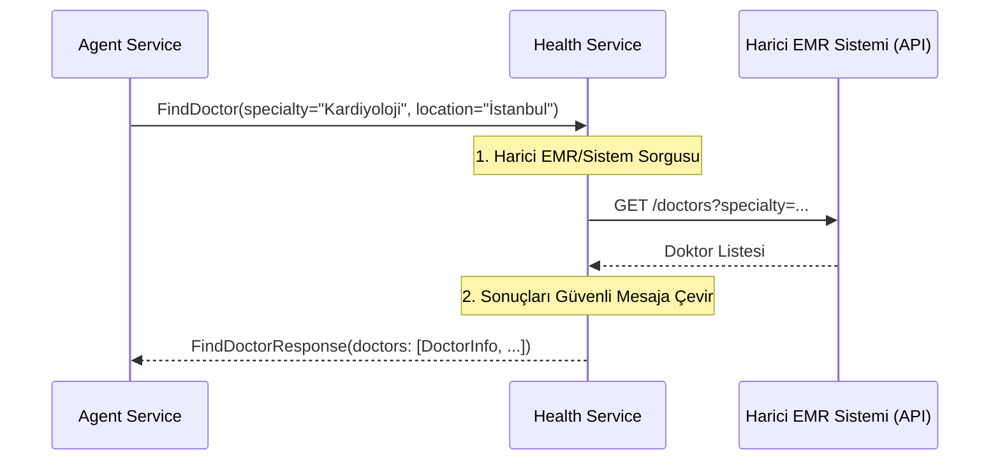

# 🏥 Sentiric Vertical Health Service - Mantık ve Akış Mimarisi

**Stratejik Rol:** Sağlık sektörüne özel iş mantığını (doktor arama, randevu planlama, tıbbi sorgulama) sunar. Hasta verilerine (HIPAA/KVKK) uyumlu güvenli bir arayüz sağlar.

---

## 1. Temel Akış: Doktor Arama (FindDoctor)

## 2. Hasta Verisi (Confidentiality)

Bu servis, hassas tıbbi verilere erişebileceği için en yüksek düzeyde güvenlik ve yetkilendirme gerektirir. Tüm veritabanı/harici API çağrılarında tenant ve user ID'lerinin yetkilendirme için kullanılması zorunludur.